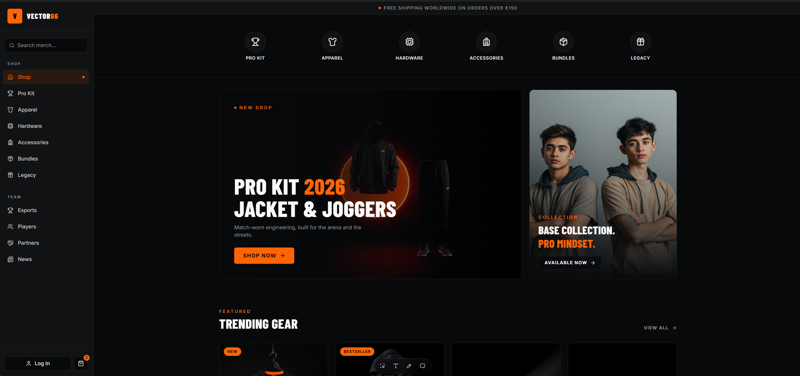

# Vector — Pro Esports Merch Store

A full-stack e-commerce storefront for a fictional pro esports organization: product catalog across six categories (Pro Kit, Apparel, Hardware, Accessories, Bundles, Legacy), authentication, cart, checkout, order history, and a newsletter signup — built end-to-end (API, frontend, tests, CI/CD, deployment) as a portfolio project.

[](https://github.com/tonymocanu97/vector/actions/workflows/backend-ci.yml)
[](https://github.com/tonymocanu97/vector/actions/workflows/frontend-ci.yml)

**Live:** https://vector-web-ruby.vercel.app/



API: https://vector-api-production.up.railway.app (Swagger disabled in production; see [Getting Started](#getting-started) to run it locally with Swagger UI)

## Tech Stack

**Backend**
- ASP.NET Core 10 Web API, Clean Architecture (Domain / Application / Infrastructure / API)
- EF Core 10 + PostgreSQL (Npgsql), code-first migrations
- Custom JWT bearer authentication, BCrypt password hashing
- NLog (console + rolling file), routed through `ILogger<T>` so business logic stays decoupled from the concrete logging provider
- Swagger / OpenAPI (Swashbuckle) with a bearer-token Authorize flow

**Frontend**
- Next.js 16 (App Router), React 19, TypeScript
- Tailwind CSS v4
- Framer Motion, Lucide/Iconify/React Icons

**Testing**
- xUnit, Moq, FluentAssertions
- Unit tests over the Application layer's service logic (mocked repositories)
- Integration tests over the full HTTP pipeline via `WebApplicationFactory`, backed by a real disposable Postgres container (Testcontainers) — not an in-memory/fake provider

**DevOps**
- Docker (multi-stage build for the API)
- GitHub Actions CI (separate backend/frontend workflows, path-filtered)
- Deployed to Railway (API + Postgres) and Vercel (frontend)

## Architecture

Plain layered Clean Architecture — no CQRS/MediatR, no ASP.NET Core Identity — chosen deliberately to keep the codebase readable over abstracted for its own sake:

- **Vector.Domain** — entities and enums, zero dependencies
- **Vector.Application** — DTOs, repository interfaces, and plain service classes containing all business logic (`AuthService`, `ProductService`, `CartService`, `OrderService`, `CategoryService`, `NewsletterService`)
- **Vector.Infrastructure** — EF Core `DbContext`, repository implementations, JWT/BCrypt implementations
- **Vector.API** — controllers and the composition root (`Program.cs`)

Services return `(T? Value, string? Error)` tuples instead of throwing on expected failure cases (duplicate email, insufficient stock, not found), which controllers map to the appropriate HTTP status code. Unexpected exceptions are caught by a single global handler and returned as a generic `ProblemDetails` response.

## Features

- Register / login with JWT issuance, BCrypt-hashed passwords
- Product catalog with category filtering and product detail pages
- Cart: add / update / remove items, with stock-quantity validation
- Checkout: stock re-validation, order snapshot (price/name at time of purchase), stock decrement, order history
- Admin-only product CRUD, role-gated via JWT claims
- Newsletter signup
- A small aim-trainer mini-game on the home page (the "cireașă de pe tort")

## Project Structure

```
Vector/
├── src/
│   ├── Vector.API             # Controllers, Program.cs, JWT/CORS/Swagger setup, nlog.config
│   ├── Vector.Application     # DTOs, repository interfaces, services (business logic)
│   ├── Vector.Domain          # Entities, enums
│   ├── Vector.Infrastructure  # EF Core DbContext, migrations, repositories, JWT/BCrypt
│   └── Vector.Web             # Next.js frontend
├── tests/
│   ├── Vector.UnitTests         # Service-layer unit tests (Moq + FluentAssertions)
│   └── Vector.IntegrationTests  # WebApplicationFactory + Testcontainers Postgres
├── .github/workflows/         # backend-ci.yml, frontend-ci.yml
├── docs/
├── Dockerfile                  # Multi-stage build for Vector.API
├── README.md
└── Vector.slnx
```

## Getting Started

### Prerequisites
- .NET 10 SDK
- Node.js 22+
- PostgreSQL (local instance, or any reachable connection string)
- Docker (only required to run the integration tests)

### Backend

Add your local database and JWT settings — either via `dotnet user-secrets` or `src/Vector.API/appsettings.Development.json`:

```json
{
  "ConnectionStrings": {
    "DefaultConnection": "Host=localhost;Port=5432;Database=vector;Username=postgres;Password=postgres"
  },
  "Jwt": {
    "Issuer": "Vector.API",
    "Audience": "Vector.Client",
    "Key": "a-long-random-development-secret-at-least-32-chars",
    "ExpiryMinutes": 60
  }
}
```

```bash
dotnet restore
dotnet ef database update --project src/Vector.Infrastructure --startup-project src/Vector.API
dotnet run --project src/Vector.API
```

API runs on `https://localhost:7055` (`http://localhost:5035`), with Swagger UI at `/swagger`.

### Frontend

```bash
cd src/Vector.Web
cp .env.local.example .env.local   # set NEXT_PUBLIC_API_URL if it differs from the default
npm install
npm run dev
```

Runs on `http://localhost:3000`. Defaults to `http://localhost:5035/api` if `NEXT_PUBLIC_API_URL` isn't set.

## Testing

```bash
# Unit tests only
dotnet test tests/Vector.UnitTests

# Integration tests (spins up a real Postgres container - Docker must be running)
dotnet test tests/Vector.IntegrationTests

# Everything
dotnet test Vector.slnx
```

## CI/CD

- **CI** (GitHub Actions, path-filtered so each pipeline only runs when its own code changes):
  - `backend-ci.yml` — restore, build, test (`dotnet test`, including the Testcontainers-backed integration suite — GitHub's `ubuntu-latest` runners have Docker preinstalled)
  - `frontend-ci.yml` — install, lint, type-check, build
- **CD**: Vector.API is deployed to Railway (Docker-based build) alongside its Postgres database; Vector.Web is deployed to Vercel. Both are connected to this repository for auto-deploy on push to `main`.
